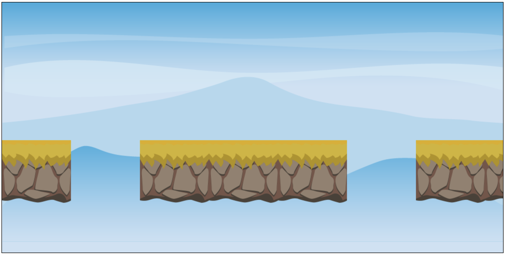

# Aufgabe 2: Plattformen zeichnen

Zeichne insgesamt 9 Plattformen, davon 3 Abgründe. Start: `x=0`.

Benutze dafür das Bild `assets/platform.png`

Größe einer Platform/eines Abgrundes: **200\*130**

Y-Wert für die Plattformen: **282**

## Ergebnis

