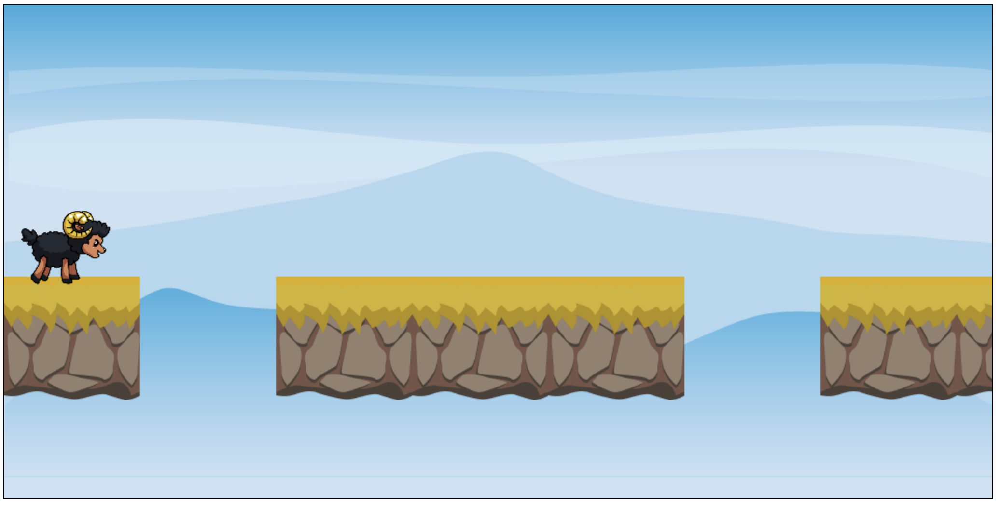

# Aufgabe 3: Schaf zeichnen

Zeichne das Schaf, erstmal noch ohne Animation. Zeichne dafür das erste Bild aus dem Tileset `assets/Black_Sheep_Idle.png`. Zeichne es 1/3 so groß wie das Quellbild.

Bildgröße der einzelnen Animationsphasen im Tileset: **325\*464**

Player-Y: **202**

**Hinweis**: `drawImage(image, sourceX, sourceY, sourceWidth, sourceHeight, x, y, width, height);`

## Ergebnis

