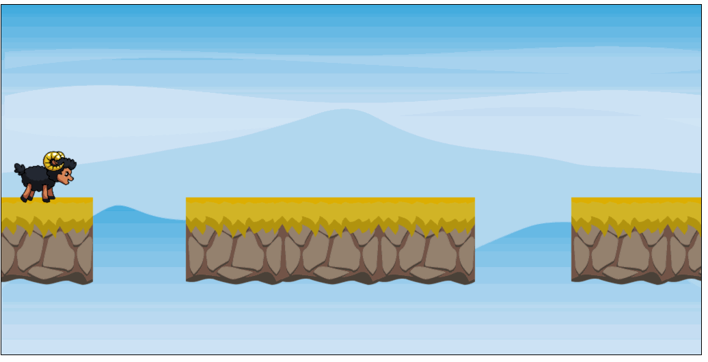

# Aufgabe 5: Plattformen bewegen

Bewege die Plattformen automatisch. Dafür musst du mit Hilfe von `requestAnimationFrame()` die Koordinaten ändern. Plattformen die links aus dem Bild laufen werden rechts wieder angefügt.

**Hinweis:** Eine gute Geschwindigkeit ist eine Bewegung um **5 Pixel** alle **35ms**

## Ergebnis

