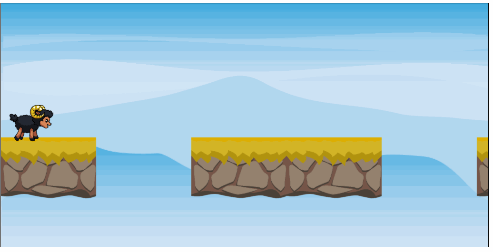

# Aufgabe 6: Start/Stop steuern

Die Plattformen sollen sich erst bewegen, wenn der Spieler/die Spielerin **Enter** drückt. Die Plattformen halten an, wenn Enter erneut gedrückt wird.

**Hinweis:** Die gedrückte Taste kann über `event.code` ermittelt werden

## Ergebnis

