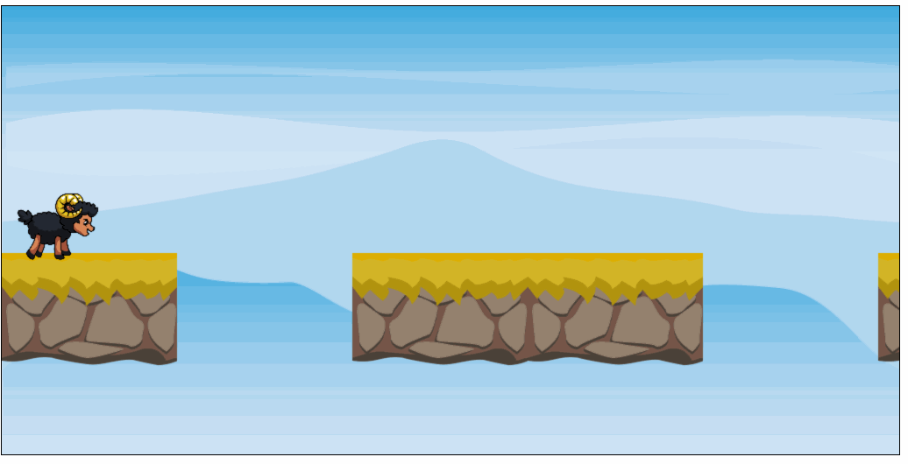

# Aufgabe 7: Lauf-Animation

Wenn der Spieler / die Spielerin auf Enter drückt, soll das Schaf in die Lauf-Animation wechseln. Bei erneutem Drücken auf Enter wechselt das Schaf zurück in die Idle-Animation

Benutze das Tileset aus `assets/Black_Sheep_Run.png`. Die einzelnen Bilder sind gleich groß wie beim Idle-Schaf.

**Hinweis:** Ein guter Wert ist ein Animationphasenwechsel alle 100ms

## Ergebnis

