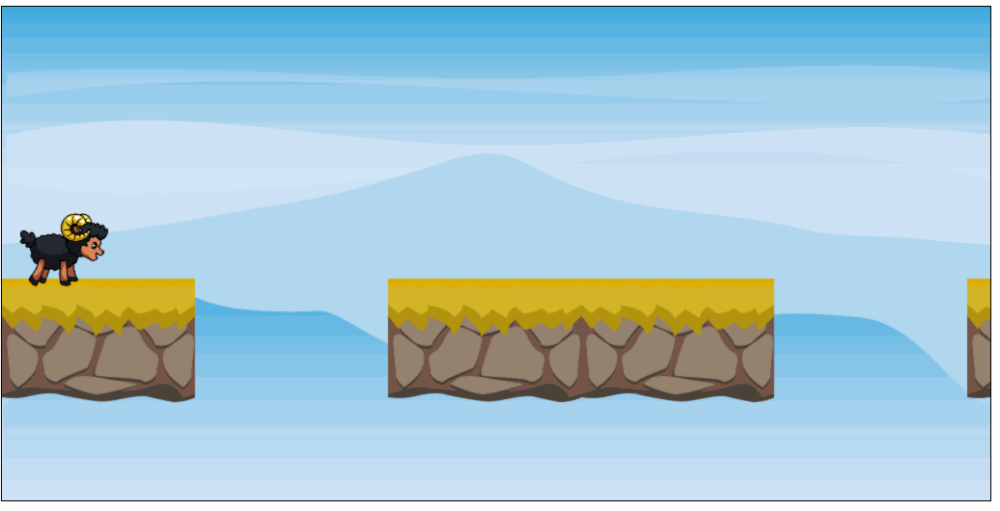

# Aufgabe 8: Sprung-Animation

Wenn der Spieler / die Spielerin auf **Space** drückt, soll das Schaf in die Sprung-Animation wechseln.

Sobald die Animation beendet wurde, wird zurück auf die Lauf-Animation gewechselt.

Springen, ohne dass sich das Schaf bereits bewegt soll nicht möglich sein.

Solange das Schaf springt, darf nicht angehalten werden.

Benutze das Tileset aus `assets/Black_Sheep_Jump.png`. Die einzelnen Bilder sind gleich groß wie beim Idle-Schaf und beim Run-Schaf.

**Hinweis:** Ein guter Wert ist ein Animationphasenwechsel alle 100ms

**Hinweis:** Während des Sprungs musst du den Player um 55px nach oben ziehen

## Ergebnis

